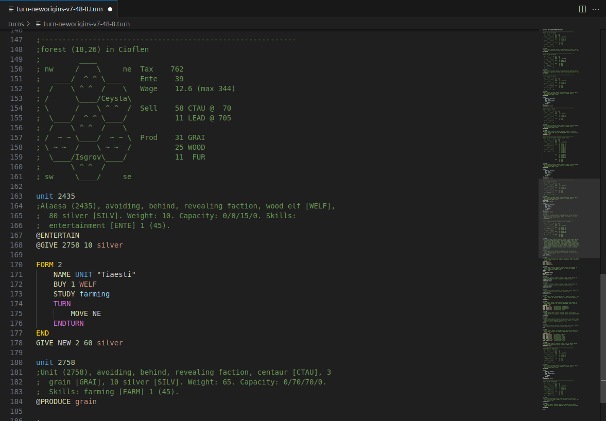

# VSCode Language Extension for Atlantis New Origins Turn Files

This is the README for your extension "turn". After writing up a brief description, we recommend including the following sections.

## Features
* Syntax highlighting of commands, skills, items and object
* Auto-closing of sections line TURN and FORM statements

### Future Features
* Item, skill and object exlanation window while hovering over them
* Visualization of the map
* Cut off of turn file out of report file
* Automatic submition of report

## Installation
To start using your extension with Visual Studio Code copy it into the `<user home>/.vscode/extensions` folder and restart Code.

## Extension Settings

Include if your extension adds any VS Code settings through the `contributes.configuration` extension point.

For example:

This extension contributes the following settings:

* `myExtension.enable`: Enable/disable this extension.
* `myExtension.thing`: Set to `blah` to do something.

## Known Issues

* #altantis macro not identified

## Release Notes

No official release yet
